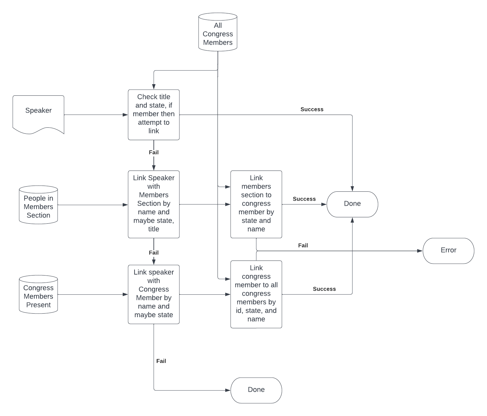

# Congressional Hearings Parser

This project gathers transcripts made available by
the US Government Publishing Office and uses this
information to assign who said what during federal
congressional meetings. The data can then be used
to gather insights on the speaking patterns of each
representative.

## How to use
1. Follow installation instructions in the main [README](../../../README.md)
to install the correct python libraries
1. Go to this website and create an api key: https://api.govinfo.gov/docs/
1. Create .env file in this folder with the key
```
GOV_INFO_API_KEY=<gov_info_key>
```
1. Run `python congress/contrib/congressional_hearing_info/grab_congressional_hearings.py --num 10`

## Sectioning text
While I wish that the format of these hearing transcripts
were better, there is not a clear standard for indicating
speakers or sections. Most follow the pattern of
`\n <Title> <Name>.` but this is not always the case. This
issue is further described in [Ways Speakers are Indicated](./ways_speakers_are_indicated.md)

## Linking Speakers to Representatives
Because
1. Members of Congress can have the same last name as
other attendants of the meeting
1. A list of the members present is not consistently
added to the mods api 
1. The section listing the members is not constantly formatted
1. States are often not added when the speaker is indicated

A complex method for linking speakers to the Member of Congress
is needed.


## Limitations
Because there is no standard format for creating these transcripts,
and the lack of transcripts for all hearings,
many transcripts cannot be fully parsed. With that said, this
project should not be used as a source for everything that a
Member of Congress has said during a meeting, but just a sample
of what they have said.

To put another way, there are many false negatives for attributing
text to representatives, but there should be very few false positives.
